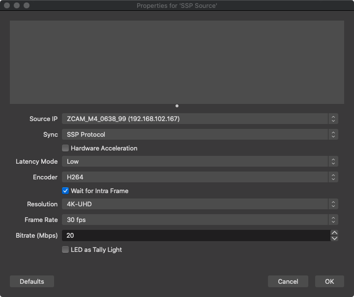

obs-ssp
==============

Network A/V in OBS Studio with Simple Stream Protocol(SSP).

## 功能
- **SSP 源** : 添加ZCAM Camera作为OBS源

## 下载
目前支持Windows和macOS 10.14+，安装包请到 [Releases](https://github.com/summershrimp/obs-ssp/releases) 页面下载.

## 交流群

Discord(仅英文): https://discord.gg/uFpTbh3AVC

QQ(仅中文):

## 自动构建

## 许可

