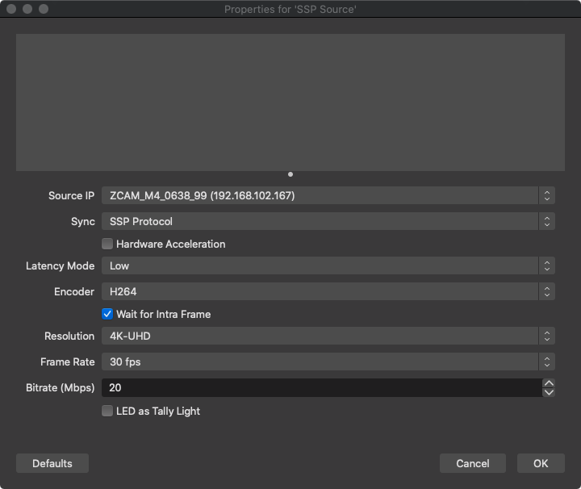

obs-ssp
==============

Network A/V in OBS Studio with Simple Stream Protocol(SSP).

[简体中文](./README-zh.md)

## Features
- **SSP Source** : receive video and audio from ZCam cameras to OBS.

## Downloads
Binaries for Windows, and macOS are available in the [Releases](https://github.com/summershrimp/obs-ssp/releases) section.

## Users group

Discord(English only): https://discord.gg/uFpTbh3AVC

QQ(Chinese only):

## Automated Builds

## License

