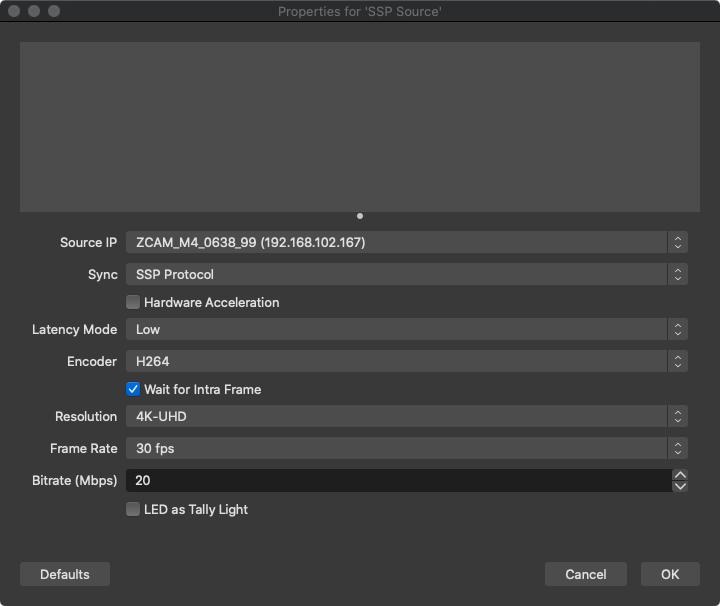

obs-ssp
==============

Network A/V in OBS Studio with Simple Stream Protocol(SSP).

[简体中文](./README-zh.md)

## Features
- **SSP Source** : receive video and audio from ZCam cameras to OBS.

## Downloads
Binaries for Windows, and macOS are available in the [Releases](https://github.com/summershrimp/obs-ssp/releases) section.

## Users group

Discord(English only): https://discord.gg/uFpTbh3AVC

QQ(Chinese only):

## Automated Builds

## Building

The build configuration tracks [obs-plugintemplate](https://github.com/obsproject/obs-plugintemplate/commit/3e7d7ac3b5342cd7d9b88890b9c70b472d1520fc).
Use CMake 3.30+ and initialize submodules with `git submodule update --init --recursive`.

- Windows: Visual Studio 2022 and Windows SDK 10.0.22621. Run `cmake --preset windows-x64`, then `cmake --build --preset windows-x64`.
- macOS: Xcode 16+ with the macOS 15 SDK. Run `cmake --preset macos`, then `cmake --build --preset macos`. The universal plugin targets macOS 12+.
- Stage Windows files with `cmake --install build_x64 --config RelWithDebInfo --prefix release/RelWithDebInfo`; copy the resulting `obs-ssp` directory to `%PROGRAMDATA%/obs-studio/plugins/`. The connector and libssp DLL must remain beside the plugin DLL.

CMake fetches the OBS 31.1.1 SDK, prebuilt dependencies, Qt 6, and libssp. Qt is required for camera controls and discovery. Ubuntu CI is disabled because libssp linkage is currently configured only for Windows and macOS. Scripts under `.github/scripts/` are intended for CI.

## License

